# FlexQL: Deep-Dive Design and Architecture Specification

**Source Code Repository:** [https://github.com/Ludirm02/FlexQL](https://github.com/Ludirm02/FlexQL)

---

## 1. Project Philosophy and Overview
FlexQL is a custom, high-performance, multithreaded SQL-like relational database engine developed from scratch entirely in modern C/C++17. Designed under strict assignment constraints to avoid any external 3rd-party database libraries, it operates natively over raw TCP sockets simulating an industry-grade distributed system. 

The primary architectural goal of this project was to resolve the **Out-Of-Core Memory Dilemma**. Specifically, the system had to be capable of ingesting over 100 Million rows (approaching 1 Terabyte constraints) on constrained hardware without encountering Out-Of-Memory (OOM) failures or leaning on RAM as the primary storage module. This dictated the engineering of a fully autonomous Page-based Buffer Eviction system heavily optimized for extreme scaling and insertion speeds exceeding top-tier leaderboard metrics (~700,000+ rows per second).

---

## 2. High-Level System Architecture
The system fundamentally operates using a rigorously decoupled client-server architecture. This prevents massive database loads from ever stalling the user-facing interfaces.

```mermaid
graph TD
    Client[FlexQL REPL Client UI] -->|TCP Socket API| Server[Network Protocol Layer]
    Server --> ThreadPool[Pre-Allocated ThreadPool Workers]
    ThreadPool --> Engine[SqlEngine AST Parser]
    
    subgraph Database Kernel
    Engine --> Cache[LRU Query Cache Hierarchy]
    Engine --> Indexing[RobinHood Primary Key Index]
    Engine --> MutexGate[std::shared_mutex Reader/Writer Locks]
    MutexGate --> RAM[Buffer Pool Manager]
    end
    
    RAM <-->|Reads & Paged Writes| Disk[Persistent .db Binary Files]
    Engine -.->|Asynchronous Push Queue| WAL[Background Write-Ahead Log Thread]
```



When an interaction executes over the terminal, the client transparently transmits the SQL payload directly to the background daemon through customized byte serialization protocols. By keeping string parsing isolated on the backend Thread Pool, clients maintain lightning-fast responsiveness while the Engine calculates exactly how to fetch or insert structures.

---

## 3. Storage Design, Memory Mapping, and Schemas 

### 3.1 Primary Storage: Disk over RAM
FlexQL mathematically abandons RAM as the primary source of truth. All tables and inserted elements exist persistently as binary chunks explicitly written to the host’s solid-state or hard disk (e.g., `data/pages/big_users.db`). Through this design, the database theoretically achieves infinite scale bounded exclusively by physical disk space limits rather than dynamic memory limitations.

### 3.2 Buffer Pool Eviction Dynamics
Because reading raw bytes from disks is exceedingly slow due to kernel context switches, the Engine routes logic through a **Buffer Pool Manager**.
* Memory is rigidly sliced into uniform fixed-capacity arrays known as *Frames*.
* When rows are requested or inserted, they are cached directly into these active frames inside RAM. 
* Once the Buffer Pool reaches its mathematical capacity constraint (simulating memory exhaustion), the engine executes an **Eviction Protocol**. It hunts down the oldest, inactive mapped memory frames, utilizes the C-API `pwrite()` function, and physically forces the binary data out to the persistent hard-drive `.db` file, cleanly re-using the RAM space for new data.

### 3.3 Row-Major Data Formatting
FlexQL mandates a **Row-Major Formatter**. Rather than storing data isolated by columns (Column-Major), every column in a specific row is clustered right next to each other in neighboring memory blocks. Because standard SQL `INSERT` commands and basic `SELECT *` routines heavily rely on fetching whole entries at a time, Row-Major formats seamlessly slip directly into the CPU's `L1/L2` physical processor cache architectures, allowing hyper-linear reading speeds during single-row iterations alongside minimal pointer-fragmentation overhead. 

### 3.4 Schema Organization
At startup, memory configuration begins instantly by reading mapping properties. Column characteristics—including exact constraints mapped to `INT`, `VARCHAR`, `DECIMAL`, and `DATETIME` definitions—are cleanly loaded from physical text representations inside the `data/tables/*.schema` folder. By tracking schema properties natively via dynamically instantiated C++ `struct Table` definitions on server boot, subsequent query parser layers do not have to conduct slow disk lookups to figure out what data type a user is calling.

---

## 4. Indexing: The Robin Hood Hashing Methodology
To ensure high query speeds over massive millions-of-rows tables, purely linear iteration searching (`O(n)` complexity) was heavily deprecated for generic primary key lookups. 

FlexQL integrates advanced **Robin Hood Hashing** mechanics to act as the primary lookup index. 
* **The "Steal from the Rich, Give to the Poor" Concept:** In standard hash maps, if two numbers hash to the exact same pointer slot (a Collision), performance degrades terribly as arrays awkwardly leap via linked lists. In our `RobinHoodIndex` logic, elements physically track how far "displaced" they are from their mathematical perfect slot. When a new key collides with an older key during an `INSERT`, the engine compares their displacement bounds. Whoever is closer to their "perfect home" gets physically shoved further down the line (stolen from) to accommodate the other target gracefully. 
* **The Impact:** This collision mitigation severely limits cluster buildup internally, dramatically reducing overall variance and guaranteeing incredibly fast, functionally identical `O(1)` query lookup bounds for target `WHERE ID = ?` requests regardless of how massive the `100-Million-Row` database gets. 

---

## 5. Caching Strategy for Peak Performance
Processing SQL execution Abstract Syntax Trees (ASTs) represents overhead. If 50 users rapidly execute the same leaderboard `SELECT ... FROM ... WHERE ...` filtering combinations over the network sequentially, re-evaluating calculations drains resources profoundly.

* **The Cache Mechanism:** We engineered `SqlEngine::QueryCache` structurally governed actively by a **Least Recently Used (LRU)** eviction boundary constraint array. Whenever `SELECT` computations finish, the resulting target vectors are packaged alongside a mathematical string hash representing exactly what the query asked for, taking up localized cached RAM limits securely. 
* **Invalidation Constraints (Table Versioning):** Intelligent caches require proactive awareness cleanly preventing stale fetching results. Inside the Engine, table mutations natively step logical timestamp bounds (Table Versions). An `INSERT` strictly escalates the mapped counter dynamically on target structures, guaranteeing overlapping LRU mapped bounds implicitly drop calculations entirely without leaking corrupted parameters back to network calls. 

---

## 6. Execution Paths & Concurrency Matrix

### 6.1 Query Traversal & Timestamps (TTL)
The database naturally satisfies dynamic timeout behaviors implicitly via injected hidden Unix structures mapping specifically against row offsets directly handling `DATETIME` comparisons dynamically. By generating real-time `now_unix()` timestamps upon query inception safely parsing across `execute_select` traversal paths, the Engine dynamically skips output processing of target boundary rows without exposing backend complexity to standard client connections natively enforcing logical expiry properties consistently. 

### 6.2 Multithreaded Shared-Readers Constraints 
Because the database is mathematically modeled as an asynchronous concurrent server actively executing operations safely mapped overlapping independent CPU pipelines mapping 15-to-30 user requests at once seamlessly, concurrency guarantees are paramount natively preventing mathematical race conditions.
* Implementing a generic `std::mutex` global boundary inherently crushes performance (it violently forces all clients to single-file queue behavior natively). 
* Specifically relying over **Readers-Writer Lock** architectures explicitly resolves bottlenecks cleanly. Executing `SELECT` structures automatically forces native bounds relying over C++17 `std::shared_mutex` instances natively scaling generic reading without pausing. When destructive mutations occur (`CREATE`, `INSERT`), an isolated `std::unique_lock` halts explicit interactions mapped specifically over overlapping table limits locking gracefully without interrupting requests targeting entirely different datasets. 

---

## 7. Client & Network Ecosystem (The REPL Interface)
Simulating user interactivity securely modeled after specific SQLite parameters aggressively mandates C-styled mappings natively. All user interfaces strictly interact dynamically inside the REPL terminal wrapped precisely within the `flexql.h` boundary limits cleanly.
* `flexql_open` executes native connection handshakes cleanly over `inet_pton` TCP mappings safely parsing headers.
* `flexql_exec` cleanly pipes AST text structures synchronously over socket mappings natively capturing block streams over strict predefined `argc`, `argv`, and `columnName` C-API structures utilizing custom mapped asynchronous callbacks directly piping output back securely over user bounds organically. 
* Memory allocated by dynamic protocol loops bounds cleanly via native explicit invocations natively executed within generic `flexql_free` functions mapping correctly to prevent hidden leak profiles cleanly. 

---

## 8. Architectural Tradeoffs & System Decisions
As specified explicitly by the unbounded restrictions defined natively by dynamic programming architectures, creating high-throughput distributed database engines requires meticulous compromises mathematically bounding constraints locally:

1. **Durability vs. Extreme Throughput (The WAL Tradeoff):** 
   To ascend mathematically over leaderboard constraints specifically testing `10-to-100 Million` bulk ingestion profiles natively running at `~700,000+` rows per second seamlessly, rigid filesystem execution operations necessarily required tradeoff boundaries natively. We deliberately implemented an asynchronous background decoupled **Write-Ahead Log (WAL) thread**. By offloading the rigid, latency-heavy SSD kernel `fdatasync()` blocks internally bounding separated threads asynchronously, we fundamentally circumvented network bottlenecks.
   * *Tradeoff Documentation:* While this guarantees absolute persistence protecting the entire database natively against standard software failure exceptions (`kill -9`, segmentation faults), it explicitly sacrifices true localized hardware-loss strict persistence (lightning-strike protection delays) uniquely enabling massive mathematical insertion loads organically mirroring advanced SQLite `PRAGMA synchronous = OFF` parameter tradeoffs elegantly. 
2. **Ambiguous Qualifier Mapping inside JOIN Constraints:** 
   Evaluating rapid conditional evaluations mapping exclusively over `INNER JOIN` AST bounds explicitly defaults string operations generically dropping exact table boundary qualifications dynamically scoping variable isolation natively (e.g. converting `A.NAME` identically routing `NAME`). While producing rapid generic mapping logic effectively resolving cross-reference metrics implicitly, edge-case evaluations overlapping strict isolated identically-named fields (e.g. `TEST.ID` mapped against `ORDERS.ID`) aggressively trigger generic boundary rejections deliberately skipping dynamic mapping complexities gracefully scaling normal constraints rapidly. 
3. **Buffer Pool Sizing vs Process Context Switching:**
   Bounding batch ingestion variables executing effectively requires strict evaluation parameter profiles. Implemented batch structures evaluating strictly via `INSERT_BATCH_SIZE = 16384` natively bounds protocol TCP overhead structures drastically yielding high ingestion metrics effectively minimizing repetitive network `read/write` loops implicitly cleanly. 

---

## 9. Compilation & Execution Instructions

To explicitly build and test the database natively on any Linux environment:

**1. Clean Build:**
```bash
make clean && make -j$(nproc)
mkdir -p data/wal data/pages data/tables
```

**2. Start the Server:**
```bash
./bin/flexql_server &
```

**3. Run the Auto-Validation Master Script:**
A comprehensive automated bash script has been provided to test the entire assignment logic sequentially (Unit tests -> 10M Benchmark -> Crash/Recovery test).
```bash
./scripts/run_all_tests.sh
```

---

## 10. Performance Results for Large Datasets
The following results were captured locally demonstrating explicit Out-Of-Core ingestion scaling seamlessly bypassing RAM bounds.

* **1M Rows:** ~390,625 rows/sec (Execution: ~2.5s)
* **10M Rows:** ~747,272 rows/sec (Execution: ~13.3s)
* **100M Rows:** ~687,266 rows/sec (Execution: ~145.5s)

The database organically withstood massive **100,000,000 row** insertions seamlessly without triggering `Out Of Memory` limits natively proving the robustness of the physical Buffer Pool mechanics.
