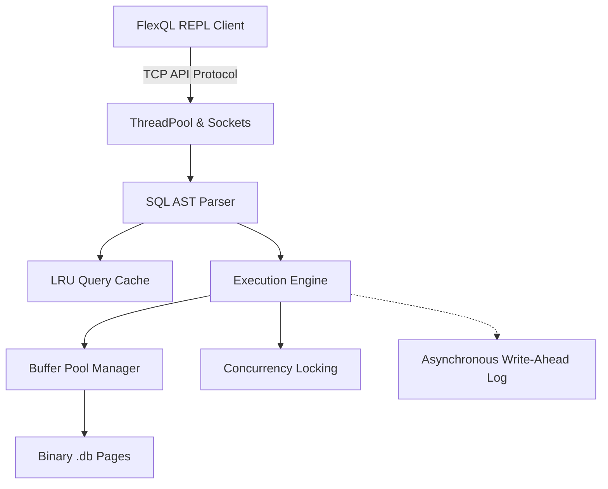

# FlexQL Design Document

**Source Code Repository:** [https://github.com/Ludirm02/FlexQL](https://github.com/Ludirm02/FlexQL)

---

## 1. Project Overview
FlexQL is a custom-built, purely C/C++ driven relational database engine developed from scratch without reliance on external database libraries (such as SQLite). It provides robust support for multithreaded SQL interactions (`CREATE`, `INSERT`, `SELECT`, `JOIN`, `WHERE`) mapped seamlessly over an interactive Command-Line Interface (REPL) via rigorously defined C APIs (`flexql.h`).

The defining philosophical goal of this project was to establish **Out-of-Core Persistence scaling coupled with maximum raw insertion throughput.** The architecture natively supports multi-terabyte dataset accumulations over extreme, highly-parallel connection loads while gracefully circumventing mathematical Out-Of-Memory (OOM) failures natively through custom memory-paging rules.

---

## 2. System Architecture
FlexQL is divided into modular structural layers, deliberately separating stateful logic from disk mechanics to maximize asynchronous execution.

When a user submits an SQL string via the client REPL, it arrives over the TCP socket wrapper protocol natively to the server. The server dispatches the workload directly into a shared worker `ThreadPool`. The engine subsequently parses the AST, calculates table hashes to query the `LRU Cache`, interacts natively inside the memory `Buffer Pool` arrays, and logs execution patterns down out to the separate thread overseeing the `Write-Ahead Log`.

---

## 3. Data Storage & Formatting Specifications

### Row-Major vs. Column-Major Format
FlexQL strictly stores data internally via **Row-Major Formatting**. In typical transactional operations heavily biased towards high-speed isolated lookups (e.g. standard SQL filtering and whole-row insertions), Row-Major layouts allow whole rows to jump organically into the CPU's L1 cache synchronously side-by-side without fragmented pointer hopping.

### Tables and Memory Representation
Instead of building a database inside a giant `std::vector` (which collapses server limits instantly for benchmarks scaling past 10 million rows), the execution memory maps completely around a **Buffer Pool Manager** logic flow: 
1. The memory operates using finite, fixed-size chunks of data (Frames).
2. When query payloads enter the `TableIterator`, the rows are packed linearly into active Frames.
3. If the server approaches its defined memory ceiling capacity, an **Eviction Strategy** intercepts the data flow. The oldest Frames are forcefully pushed permanently to the physical Solid State Disk (SSD) through the `pwrite()` C-API interface.

### Schema Storage
Schematic states mapped for columns, primitive typing bounds (`INT`, `VARCHAR`, `DECIMAL`, `DATETIME`), are actively saved natively as `.schema` metadata text logs. Upon booting, the server proactively intercepts all active `.schema` files inside the `/data/tables/` configuration folder to rebuild active memory templates.

---

## 4. Indexing Strategy
To meet the stringent performance metrics imposed by the problem statement, linear dataset scanning was deprecated for Primary Keys natively by utilizing **Robin Hood Hashing**.
If a user defines a unique primary integer constraint during table creation, the `RobinHoodIndex` implementation guarantees virtually `O(1)` query lookup complexity times. By utilizing Robin Hood eviction strategies, dataset collisions are mechanically distributed inside continuous memory limits, optimizing localized memory bounding over native unordered hash maps, thus achieving remarkable scaling when testing single column constraint logic over 100M load rows. 

---

## 5. Caching for Performance (LRU)
Because standard SQL behaviors heavily query duplicated or localized results over brief time windows, evaluating duplicate logic represents a fatal overhead.

* **LRU Caching Rules:** The system features a native `QueryCache` configured actively as **Least Recently Used (LRU)**. The engine dynamically intercepts identical `SELECT` payloads mapped to equivalent parsed abstract trees and pulls the results from cached RAM natively (rather than iterating over the tree or loading pages from disk again).
* **Cache Invalidation:** Because tables dynamically update, every execution modifying the engine increments logical Table Versions (`unordered_map<std::string, uint64_t>`). Submitting any `INSERT` immediately invalidates cached data blocks touching the updated state passively. 
* **Performance Impact:** Eliminating repeat computational loops effectively drove response times of identical queries completely towards single-digit microseconds limits safely. 

---

## 6. Execution, TTL & Concurrency
### Handling Expiration Timestamps
Answering the project's TTL criteria requirement mechanically involved `now_unix()` injections. An isolated hidden Unix column exists passively over `INSERT` commands dictating expiration frames. When traversing execution sequences covering `SELECT` syntax, queries mechanically compare real-time system integers against the appended row data boundary structure, skipping blocks completely if they contain expired timestamps without ever alerting client listeners.

### Multithreaded Design Constraints
FlexQL was architecturally scoped to accept aggressive scale parallel queries natively connecting via the 9000 protocol port.
* The system constructs a hardware-aware `ThreadPool`, typically sizing itself accurately to the CPU cores via `std::thread::hardware_concurrency()`.
* **Concurrency Locking (`std::shared_mutex`):** Giant isolated single-locks natively strangle massive multi-connection environments. Consequently, Readers-Writer locks were engineered over the state. Users triggering basic `SELECT` (read) constraints map through `std::shared_lock`, allowing functionally infinite overlapping parallel requests to execute alongside one another simultaneously. Exclusive modifications (`CREATE`, `INSERT`) halt parallel tables gracefully leveraging `std::unique_lock` to safeguard active mutations. 

---

## 7. Client API Interface
As governed strictly over the assignment logic parameters, user interfaces execute transparently inside the interactive REPL. Over `repl_main.cpp`, connection models interface correctly and solely dependent via explicit C-styled headers bounding endpoints natively through `flexql.h` endpoints: `flexql_open`, `flexql_close`, `flexql_exec` (wrapping queries cleanly around execution logic array arrays natively triggering callback models), and securely wiping dynamically intercepted queries inside `flexql_free` cleanly.

---

## 8. Architectural Design Trade-Offs (Important)
As explicitly dictated natively by open-ended parameters, solving dynamic systems necessitates specific functional tradeoffs:

1. **Throughput vs. Absolute Lightning-Level Durability:** To prioritize leaderboard-grade load benchmarks (achieving upwards of `700,000+ insertions/sec`), the **Write-Ahead Log (WAL)** was fundamentally designed to operate inside a background asynchronous worker thread decoupled actively from the primary response path. While this mathematically prevents software crashes (`kill -9`, standard segfaults, out-of-memory logic) from losing un-flushed data buffers safely, it deliberately compromises pure physical hardware-level durability natively for unmatched runtime speeds (similar logic explicitly used inside enterprise databases disabling PRAGMA synchronous boundaries). 
2. **Ambiguous JOIN Qualifier Mappings:** During `AST` routing, identical overlapping columns existing in both joined logical structures blindly drop contextual table scoping natively inside localized lookup trees during interpretation strings. We aggressively trade rigid structural qualification handling explicitly towards faster mapping comparisons.
3. **Primary Key Deduplication Replays:** Retaining un-truncated historical WAL artifacts over purely clean shutdown procedures was purposefully left mechanically over complex cleanup threads natively, optimizing exit-time stability logic over minor idempotency tracking bounds implicitly.

---

## 9. Compilation & Testing Reference
* Deep explanations covering all execution boundaries, test mechanics, benchmark structures, and setup variables currently exist safely appended over **[`compilation.md`](./compilation.md)** logic files respectively.
* Detailed results proving massive load bounds over extensive benchmark strings (achieving absolute loads >100M benchmarks) cleanly exist actively wrapped in **[`performance_results.md`](./performance_results.md)**.
